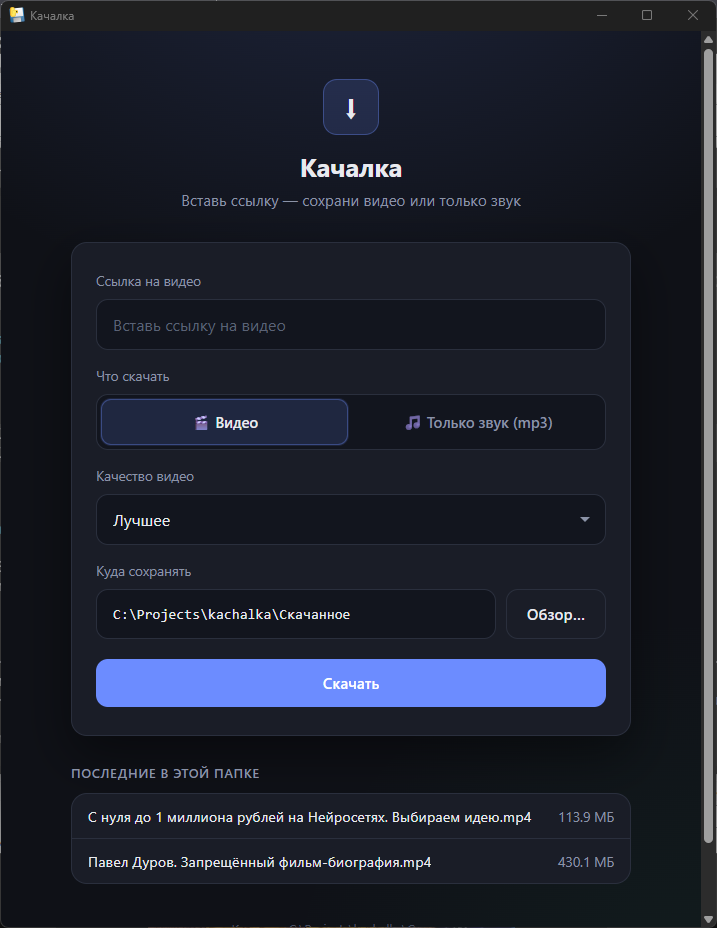

# ⬇ Качалка

**Версия 1.3.1**

Скачиватель видео и аудио с YouTube и тысяч других сайтов.  
**Обычное окно Windows** — без браузера, без чёрной консоли.

Вставил ссылку → выбрал формат и папку → **Скачать**.



---

## Возможности

### Скачивание
- **Ссылка на видео** — YouTube, VK (`vk.ru` / `vk.com` / `vkvideo.ru`), Rutube и сотни других сайтов (движок [yt-dlp](https://github.com/yt-dlp/yt-dlp))
- **YouTube, если обычный файл не отдают** — открытый ролик иногда режется ошибкой 403. Качалка берёт запасной файл (часто 360p) и не пишет, что доступ запрещён
- **Ролик внутри страницы** — вставь адрес статьи: Качалка найдёт встроенный плеер (YouTube, ВК, Rutube, GetCourse и др.) или файл mp4. Если роликов несколько, можно выбрать, какой скачать
- **ВК** — нормализация ссылок, предпочтение `vk.ru`, cookies браузера / `cookies.txt` для закрытых роликов
- **🎬 Видео** — лучший доступный mp4 со склейкой видео и звука (через ffmpeg)
- **🎵 Только звук (mp3)** — вытаскивает аудио и сохраняет как mp3
- **Качество видео:**
  - **Лучшее** — максимальное доступное качество
  - **До 720p** — меньше весит
  - **До 480p** — совсем лёгкий файл
- **Прогресс в реальном времени** — проценты, размер, скорость (по-русски)
- **Понятные ошибки** — «видео недоступно», SSL, закрытое ВК и т.п., без падения программы

### Папка и файлы
- **Куда сохранять** — любая папка на диске
- **Обзор…** — одно окно выбора папки текущей Windows
- По умолчанию: папка **«Скачанное»** рядом с программой
- **Открыть папку** — сразу в Проводнике после загрузки
- **Последние в этой папке** — список уже скачанных файлов с размерами
- **Скачать ещё** — быстрый следующий ролик

### Внешний вид
- Тёмная тема, одно окно приложения
- Работает **локально** на вашем ПК (интернет нужен только для загрузки ролика)

### Режимы запуска
| Способ | Для кого |
|--------|----------|
| `start.bat` | Разработка: окно приложения |
| `start_web.bat` | Запасной режим в браузере |
| `kachalka.py` | Консоль: вставил ссылку — Enter |
| `Kachalka.exe` / Setup | Готовое приложение без Python |
| Расширение Chrome / Яндекс | Значок на открытой странице: отметить ролики и скачать |

### Сборка и установка
- Portable-сборка: `dist\Kachalka\Kachalka.exe`
- Инсталлятор: `dist\Kachalka-Setup.exe` (Inno Setup)
- Установка в `%LocalAppData%\Kachalka` **без прав администратора**
- Повторный запуск Setup **обновляет** уже установленную Качалку в той же папке. Скачанные файлы остаются

---

## Быстрый старт (из исходников)

1. **`install.bat`** — один раз  
   поставит yt-dlp, fastapi, uvicorn, pywebview и портативный ffmpeg  
2. **`start.bat`** — откроется окно «Качалка»  
3. Вставь ссылку → выбери видео/mp3 и качество → **Скачать**

Если что-то не так — запусти **`check.bat`**: он скажет, чего не хватает.

### Требования
- Windows 10/11  
- Python 3 (для режима из исходников; в Setup не нужен)  
- Интернет  
- [WebView2](https://developer.microsoft.com/microsoft-edge/webview2/) — обычно уже есть с Edge  

---

## Расширение для Chrome и Яндекс.Браузера

Значок Качалки читает **открытую вкладку**. Адрес страницы YouTube, ВК или Rutube уже считается роликом. На обычной статье ищутся встроенные плееры. Один ролик уже отмечен. Если роликов несколько, у каждого свой чекбокс — отметь нужные и нажми «Скачать выбранные». Программа должна быть запущена: файлы качаются по очереди в её текущую папку. После замены файлов расширения нажми круглую стрелку «Обновить» на его карточке.

Установка расширения (один раз):

1. Chrome: открой `chrome://extensions`. Яндекс.Браузер: `browser://extensions`.
2. Включи **режим разработчика**.
3. **Загрузить распакованное расширение** и укажи папку:
   - из исходников: `extension` в папке проекта;
   - после установки программы: `%LocalAppData%\Kachalka\extension`.

## Как пользоваться окном

1. **Ссылка на видео** — вставь адрес ролика  
2. **Что скачать** — «Видео» или «Только звук (mp3)»  
3. **Качество видео** — «Лучшее» / «До 720p» / «До 480p» (для mp3 не нужно)  
4. **Куда сохранять** — путь вручную или **Обзор…**  
5. **Скачать** — смотри прогресс; по готовности открой папку или скачай ещё  

---

## Сборка .exe и инсталлятора

Подробно: **[BUILD.md](BUILD.md)**

Кратко:

```text
1) build_exe.bat         →  dist\Kachalka\Kachalka.exe
2) make_installer.bat    →  dist\Kachalka-Setup.exe
```

Порядок важен: сначала exe, потом Setup (иначе Inno Setup ругается, что нет файлов).

---

## Структура проекта

```text
kachalka/
├── desktop_main.py      # окно приложения (pywebview)
├── app.py               # сервер + логика скачивания
├── kachalka.py          # консольный режим
├── pick_folder.py       # диалог выбора папки
├── extension/           # расширение Chrome и Яндекс.Браузера
├── static/index.html    # интерфейс
├── ffmpeg/bin/          # портативный ffmpeg
├── Скачанное/           # папка по умолчанию
├── start.bat            # запуск окна
├── start_web.bat        # запуск в браузере
├── install.bat          # установка зависимостей
├── check.bat            # диагностика
├── build_exe.bat        # сборка exe
├── make_installer.bat   # сборка Setup
├── installer.iss        # скрипт Inno Setup
├── docs/screenshot.png  # скриншот для README
└── BUILD.md             # инструкция по сборке
```
